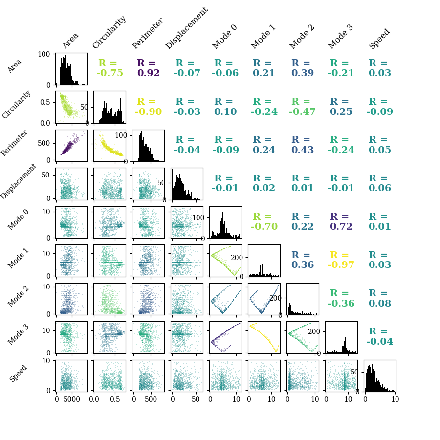

`PhagoPred.feature_extraction.extract_features`

Features describing the morphology and dynamics of each cell are then extracted. These are classed as either [primary](#primary-features) or [secondary](#secondary-features) features depending on the information required to compute them. All feature classes inherit from `PhagoPred.feature_extraction.features.BaseFeature()` class and must have a `compute()` method.
# Primary Features
`def compute(self, mask: torch.tensor, image: torch.tensor) -> np.array:`

These are calculated directly from the segmentation masks and raw images. They are computed for a batch of cells in each frame at a time to allow calculations to be performed on the GPU for faster speeds.
- Coords
- Perimeter
- Circularity
- Morphology Modes
- Gabor Scale

# Secondary Features
`def compute(self, phase_xr: xr.Dataset, epi_xr: xr.Dataset) -> np.array:`

These are calculated from other features. They take the datasets of all other features as their arguments, stored as xarray Datasets backed with Dask (allowing parallelised computation with automatic batching).
- Speed
- Displacement
- Surrounding cell density

# Examples
## Individual Cell

|  |  |

## Correlation Plot
`PhagoPred.display.plots.plot_feature_correlations()`
Correlation plot of a subset of the features. *R* gives the correlation coefficient between each pair of features and histograms of each feature are shown on the diagonal.

