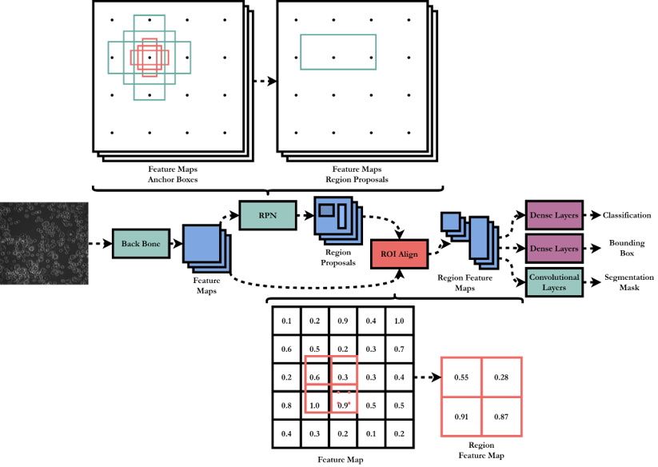
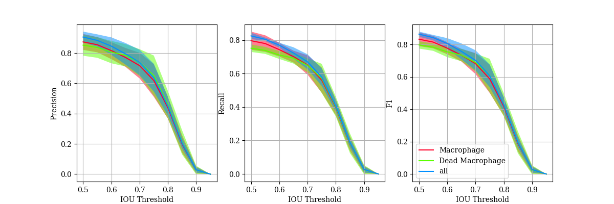
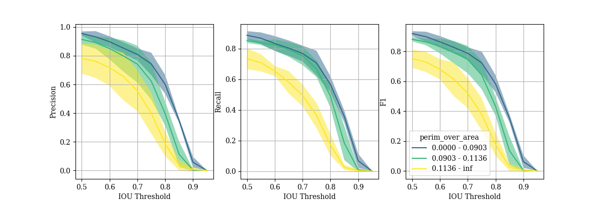

# Mask R-CNN
Each image is segmented with a [Mask R-CNN](https://arxiv.org/abs/1703.06870) network, implemented using [Detectron2](https://github.com/facebookresearch/detectron2) and pretrained on 2.5 million instances of objects (the [COCO Datset](https://cocodataset.org/#home)). This allows the network to achieve rasonable segmentation performance when fine tuned on ~500 instances of macrophages.
## Architecture Overview

1. **Backbone** – A pretrained convolutional neural network classifier, which is truncated before outputting a class.  This results in a  feature map of the total image.
2. **Region Proposal Network** – From the feature map, a set of rectangular region proposals are extracted, each with an associated probability of containing an object. The network is again convolutional, with a regressor branch to adjust the proposed region shape, and classifier to give the object probability.
3. **ROI Align** – The region proposals are used to extract sections of the feature map. ROI Align provides an improvement over previous methods for this step by interpolating the feature map to allow the exact proposed region to be extracted.
4. **Output** – Each extracted feature map is then passed through dense layers to give a class and bounding box prediction. Convolutional layers output a segmentation mask. 
## Performance
 Ground Truth
 Prediction 
 Overlap of ground truth and prediction

In order to quantitatively evaluate the performance, precision, recall and F1-score are calculated. The require each instance to be classed as a True Positive, False Positive or False Negative. Therefore, they are calucated over a range of Intersection over Union (IOU) thresholds.
$$IoU = \frac{Area \: of \: Intersection}{Area \: of \: Union}$$
$$Precision = \frac{Correct \: Predictions}{Total \: Predictions} = \frac{TP}{TP+FP}$$
$$Recall = \frac{Correct \: Predictions}{Total \: Ground \: Truth} = \frac{TP}{TP + FN}$$
$$F1 = \frac{2 \times Precision \times Recall}{Precision + Recall}$$

These metrics can also be calculated for subsets of the cells, allowing the effect of individual cell features on segmentation peroformance to be determined. Below are precision-recall curves for three subsets of cells with different ranges of perimeter over area. Thos with the highest perimeter over area (so less circular shape) performed significantly worse, suggesting more training data containing these sorts of cells should be included.

